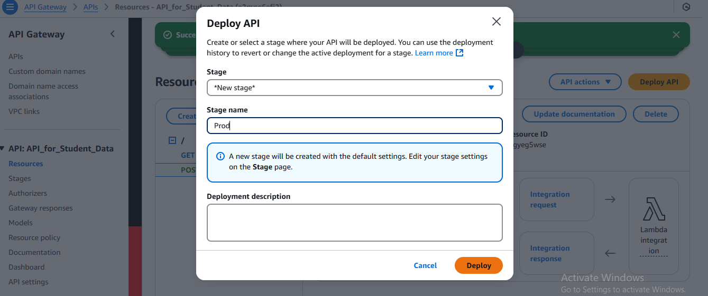

# ☁️ AWS Serverless Web Application

## 📖 Project Overview
This project demonstrates how to build and deploy a **serverless web application** on AWS.  
The architecture includes the following components:  
- **Amazon S3** for static website hosting  
- **Amazon API Gateway** for exposing RESTful APIs  
- **AWS Lambda** for serverless compute functions  
- **Amazon DynamoDB** for NoSQL database storage  
- **AWS IAM** for access control  
- **Amazon CloudFront** for secure, low-latency content delivery  

---

## 🏗️ Project Layout
The following diagram represents the complete application flow:  

---

## 🚀 Implementation Steps

### 1. Create DynamoDB Table
- Open the **DynamoDB Console** and select **Create Table**.  
- Table name: `student-data`  
- Partition key: `studentID` (String).  

  

---

### 2. Create IAM Role for Lambda
- Navigate to **IAM → Roles → Create Role**.  
- Select **AWS Service → Lambda** as trusted entity.  
- Attach the **AmazonDynamoDBFullAccess** policy.  
- Name the role `Lambda-DynamoDB-Access` and create it.  

  
  

---

### 3. Create Lambda Functions
We need two Lambda functions:  
- **POST Lambda** → Inserts student data into DynamoDB.  
- **GET Lambda** → Retrieves student data from DynamoDB.  

Steps:  
- Go to **Lambda Console → Create Function**.  
- Choose runtime: **Python 3.x**.  
- Assign the IAM role created earlier.  
- Write code for POST and GET separately.  
- Deploy and test with sample payloads.  

  
  
  
  

---

### 4. Configure API Gateway
- Open **API Gateway Console** → **Create API**.  
- Add two methods:  
  - **POST** → linked to POST Lambda.  
  - **GET** → linked to GET Lambda.  
- Deploy the API to a stage (e.g., `production`).  
- Copy the **Invoke URL**.  

  
  
  
  

---

### 5. Host Web Content on S3
- Create a new **S3 bucket**.  
- Uncheck “Block all public access”.  
- Enable **Static Website Hosting**.  
- Upload `index.html`, `error.html`, and other web files.  
- Note down the S3 Website Endpoint.  

  
  
  

---

### 6. Configure S3 Bucket Policy
- Go to **Permissions → Bucket Policy**.  
- Use the AWS Policy Generator to create a policy.  
- Allow `s3:GetObject` for `*` on the bucket ARN.  
- Apply the policy to make files publicly readable.  

  
  

---

### 7. Connect Frontend to Backend
- Edit your `index.html` file.  
- Replace the placeholder API URLs with the **API Gateway Invoke URL**.  
- Upload updated files to S3.  

  
  

---

### 8. Test the Application
- Open the **S3 Website Endpoint** in your browser.  
- Enter student details and submit the form (POST request).  
- Check **DynamoDB** to confirm data insertion.  
- Retrieve student data via GET request to verify retrieval.  

  
  
  
  
  
  

---

### 9. Secure Website with CloudFront
- Go to **CloudFront Console → Create Distribution**.  
- Choose your **S3 bucket** as the origin.  
- Enable **Redirect HTTP to HTTPS**.  
- Copy the CloudFront distribution domain.  
- Now your app is served securely via HTTPS with low latency.  

  
  
  
  
  
  

---

### 🔒 Final Verification
- Compare **S3 Endpoint (HTTP)** and **CloudFront URL (HTTPS)**.  
- Ensure both index and error pages are working.  

  
  

---

## 🔗 Final URLs
- **CloudFront Secure URL**: `https://<your-distribution-id>.cloudfront.net/`  
- **S3 Website URL**: `http://<your-bucket-name>.s3-website.<region>.amazonaws.com/`

---

## 🎯 Benefits
- **Serverless architecture** → No servers to manage.  
- **Scalable**
