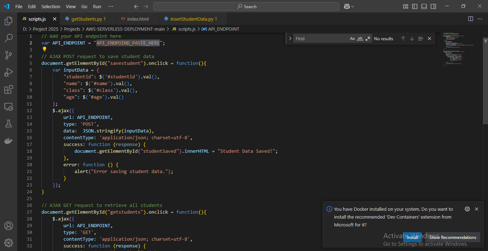

# ☁️ AWS Serverless Web Application

## 📖 Project Overview
This project demonstrates how to build and deploy a **serverless web application** on AWS.  
The architecture includes the following components:  
- **Amazon S3** for static website hosting  
- **Amazon API Gateway** for exposing RESTful APIs  
- **AWS Lambda** for serverless compute functions  
- **Amazon DynamoDB** for NoSQL database storage  
- **AWS IAM** for access control  
- **Amazon CloudFront** for secure, low-latency content delivery  
# ☁️ AWS Serverless Web Application

---

## 🏗️ Project Layout

---

## 1️⃣ Create DynamoDB
- Create a DynamoDB table.  
- Table name: `student-data`.  

---

## 2️⃣ Create IAM Role
Since we need an IAM role assigned to Lambda functions to access DynamoDB, we will create an IAM role.  

Steps:  
1. Go to **Identity and Access Management (IAM)**.  
2. Click **Create Role**.  

  
  

- Select the service for which we are creating the role. In this case, select **Lambda function**.  

- Add permission to access DynamoDB.  

- Name the role and click **Create**.  

---

## 3️⃣ Create Lambda Functions
We will create two Lambda functions:  
- First → to POST data to DynamoDB  
- Second → to GET data from DynamoDB  

### First Lambda Function (POST)
- Select the IAM role created earlier.  

  

- Delete the default code and paste your Lambda code.  

### Second Lambda Function (GET)
- Create another Lambda function.  
- Keep everything the same.  

  
  

- Paste the GET Lambda code here.  

- Test the function to check if it works properly.  

---

## 4️⃣ Configure API Gateway
Now go to API Gateway to connect the webpage with Lambda functions.  

  

- Create two methods: one GET and one POST. Associate them with Lambda functions respectively.  

  
  
  
  
  
  
  
  
  

- Give the stage a name (e.g., `production`).  

  

- Copy the Invoke URL and paste it into your webpage code that will be uploaded to the S3 bucket.  

---

## 5️⃣ Create S3 Bucket for Web Hosting
- Create an S3 bucket for web hosting.  

  

- Upload code into the S3 bucket.  

- Edit static website hosting settings in the S3 bucket to make it publicly accessible.  

  

---

## 6️⃣ Create and Apply Bucket Policy
- Create a bucket policy using the Policy Generator.  

- Copy the generated policy and paste it into the S3 bucket policy editor.  

- If the bucket is not public, the policy will not be applicable and will give a conflict error. Change the bucket status to **Public**, then reapply the policy.  

Now our page is publicly accessible via S3 web hosting.  

---

## 7️⃣ API Gateway Triggers Lambda
API Gateway will trigger the Lambda function when requests are made from the webpage.  

---

## 8️⃣ Enter Data and Test Website
- Enter some data on the website and submit.  

- POST successful → now check if the data can be retrieved. Click **View All Students**.  

- The posted data is successfully retrieved and displayed.  

---

## 9️⃣ Important Note — S3 Website Is Not Secure
- The website hosted by S3 is **not secure**.  
- URL Example:  
  `http://web-app-for-student-data.s3-website.eu-north-1.amazonaws.com/`  

Since the link uses **HTTP**, it is not secure.  
To make it secure, we will use **CloudFront**, which not only secures the website but also reduces latency.  

---

## 🔟 Create CloudFront Distribution
- Create a CloudFront distribution and add the S3 bucket URL.  

- Keep the remaining settings as default.  

- Once created, you will get a new domain name where the same content will be displayed securely.  

### URLs:
- **CloudFront URL:** `https://d11g10oy7djsyh.cloudfront.net/`  
- **S3 Bucket URL:** `http://web-app-for-student-data.s3-website.eu-north-1.amazonaws.com/`

---

## 🎯 Benefits
- **Serverless architecture** → No servers to manage.  
- **Scalable** → Handles traffic spikes easily.  
- **Secure** → CloudFront HTTPS + IAM roles.  
- **Low-cost** → Pay only for what you use.  

---

## 🧠 Key Learnings
- Creating and configuring **DynamoDB tables**.  
- Assigning correct **IAM roles and permissions**.  
- Writing Lambda functions for **CRUD operations**.  
- Exposing Lambda via **API Gateway**.  
- Hosting a static site with **Amazon S3**.  
- Distributing content globally via **CloudFront**.  

---
